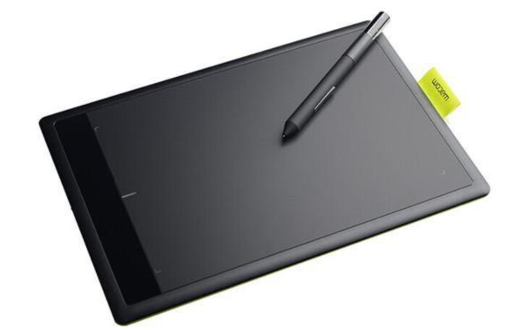

# 绘画的学习

## 资料参考

[素描的诀窍](https://book.douban.com/subject/25957239/)

[油画的光与色](https://book.douban.com/subject/4881500/)

## 工具

### 硬件

数位板

### 软件

Krita

## 学习路线

### 线条练习

一切的开始, 所有绘画的基石

摘自[ krita 文档 ](https://docs.krita.org/en/tutorials/inking.html)

> The first thing to realize about inking is that unlike anatomy, perspective, composition or color theory, you cannot compensate for lack of practice with study or reasoning. This is because all the magic in drawing lines happens from your shoulder to your fingers, very little of it happens in your head, and your lines improve with practice. On the other hand, this can be a blessing. You don’t need to worry about whether you are smart enough, or are creative enough to be a good inker. Just dedicated.

首先, 和其他的技术不一样, 光有理论不练是画不好线条的.

画线条不取决于智力和创造力, 只需要投入就行.

#### 线条长度和发力方法

不同长度的线条需要使用不同的发力方式绘制

3cm: 手指

10cm: 手腕

20cm: 手肘

30cm: 肩膀

#### 线条的类型

直线: 横线, 竖线, 对角斜线

曲线: C 形, S 形, O 形

### 笔势

"素描的诀窍"里介绍了笔势的概念: 自由笔势, 控制笔势

自由笔势: 松散, 随性, 不加思考

控制笔势: 细致, 小心翼翼, 充分思考

使用自由笔势画草稿, 多次勾勒出轮廓, 再基于大致轮廓, 使用控制笔势刻画细节

### 物体的形

#### 几何中心

为了不会画着画着发现画布不够大或是画歪了, 一开始确定物体的几何中心, 放置在画布的合适位置

#### 测量

举起画笔, 伸直手臂, 当作游标卡尺来观察对象

### 光影和色彩

#### 光影的要素

亮部, 暗部, 反射, 高光

#### 不要去思考, 而是去观察

忘掉脑内物体的颜色, 去观察

#### 更亮或更暗, 使用对比

颜色暗不一定真正的暗, 亮的部分不一定是用亮的颜色绘制的

#### 不要一团糟, 概况出色块形状

对象复杂无从下手? 从色块形状入手
